# React 19

## FEM

[Brian's course](https://frontendmasters.com/courses/complete-react-v9/react-19/)

* Form actions
* use & Suspense
* React compiler

## YouTube React 19 Crash course

[Playlist](https://frontendmasters.com/courses/complete-react-v9/react-19/)

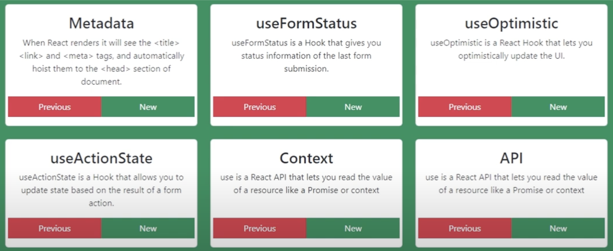

* Metadata
* [useFormStatus](https://react.dev/reference/react-dom/hooks/useFormStatus) - `<form action>`

    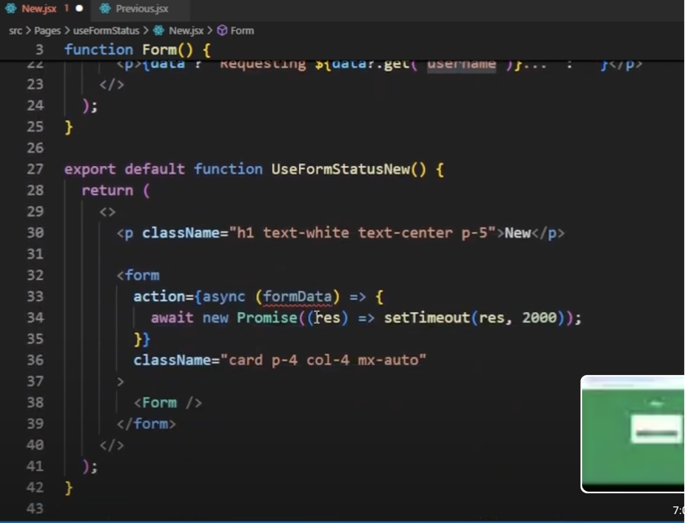

    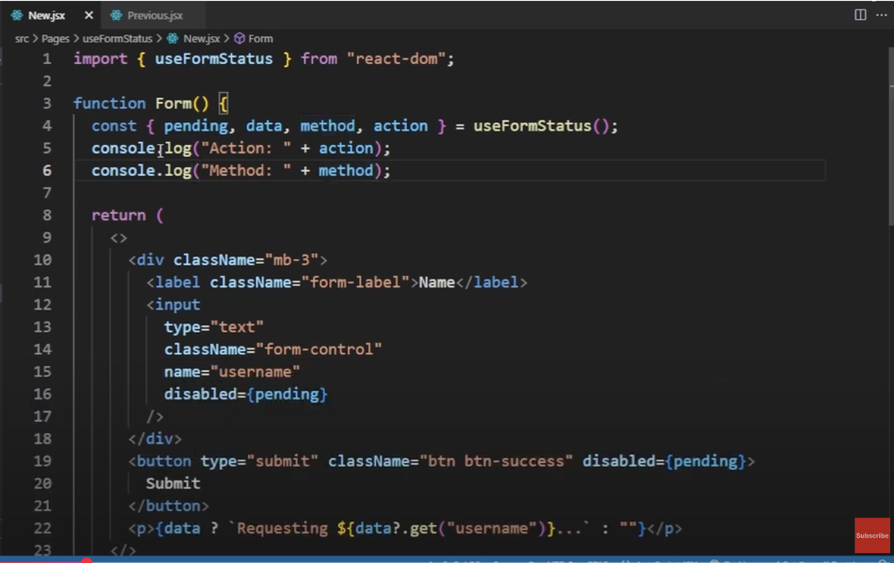

* [useOptimistic](https://react.dev/reference/react/useOptimistic) 

    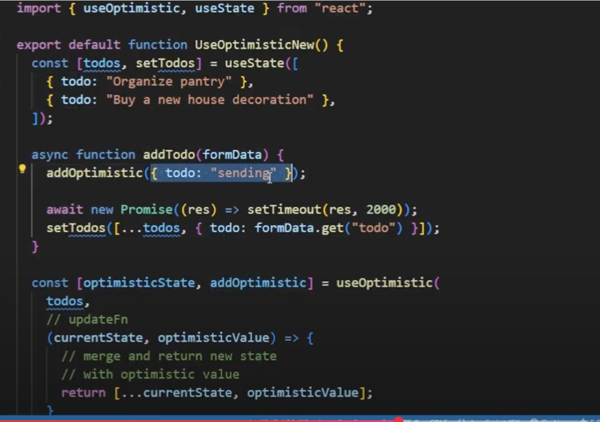

    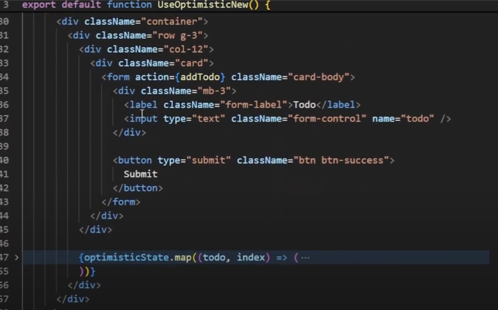

* [useActionState](https://react.dev/reference/react/useActionState)

    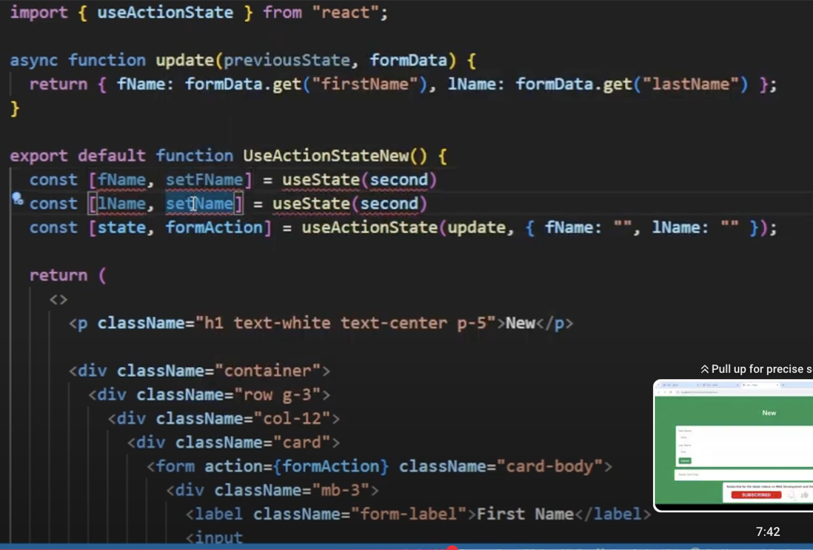

    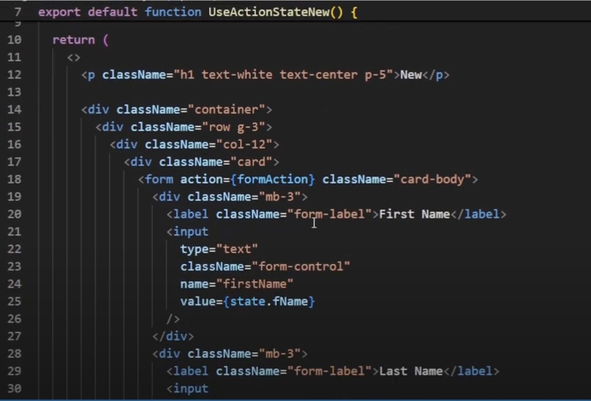

   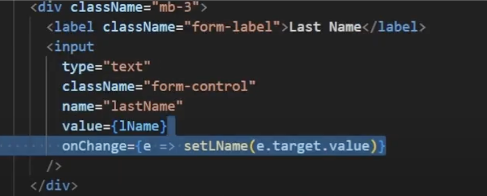

    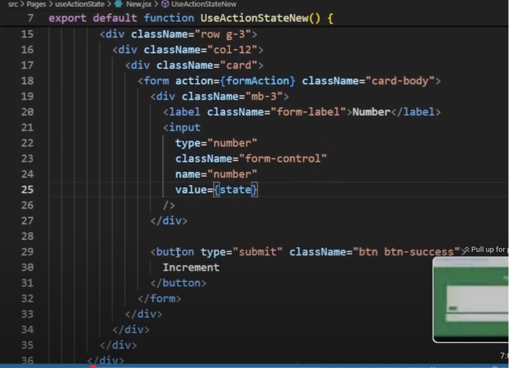

    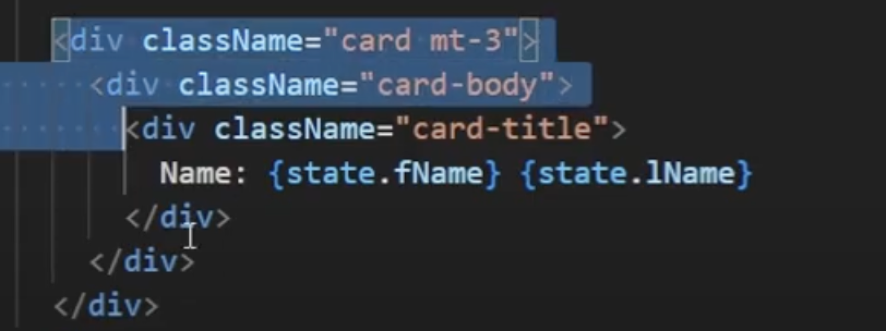

* [use](https://react.dev/reference/react/use) hook with context

    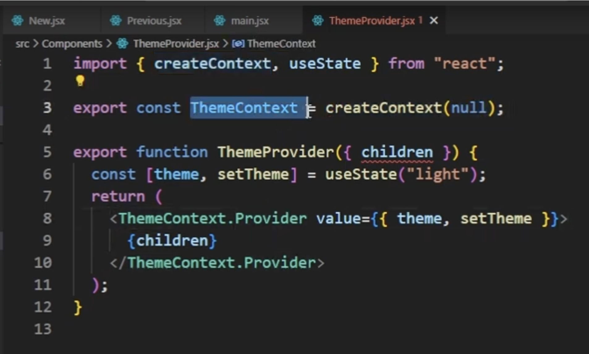

    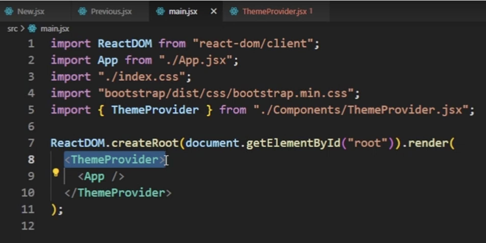

    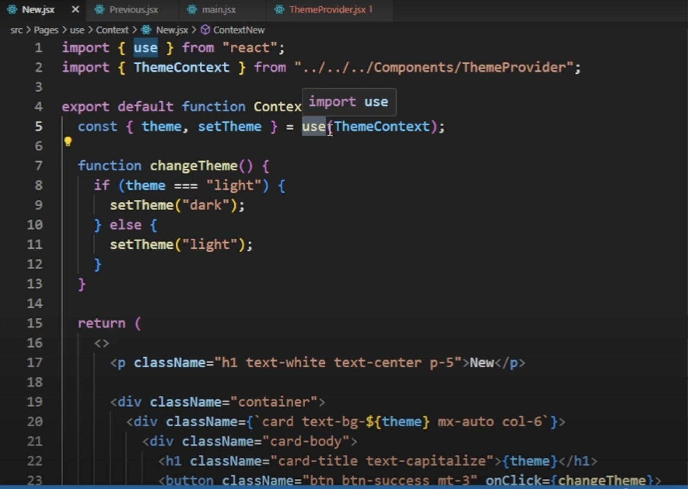

    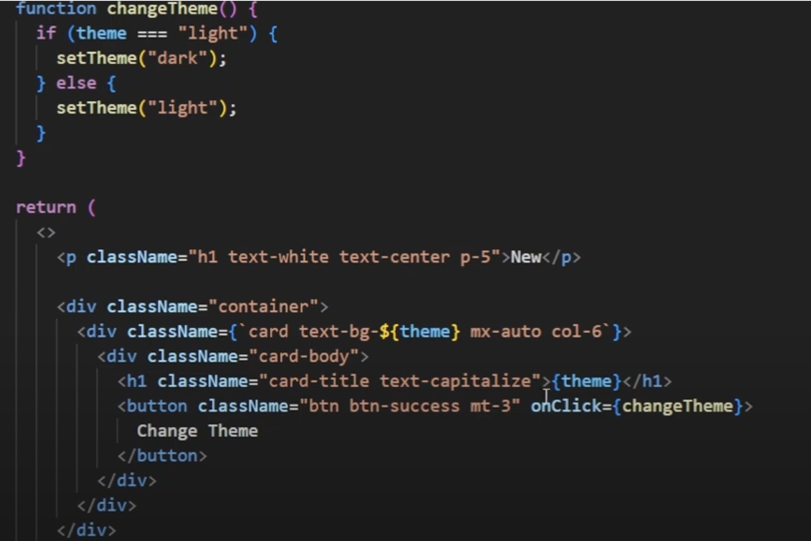

* [use]() hook with API - removed need for useEffect and useState

    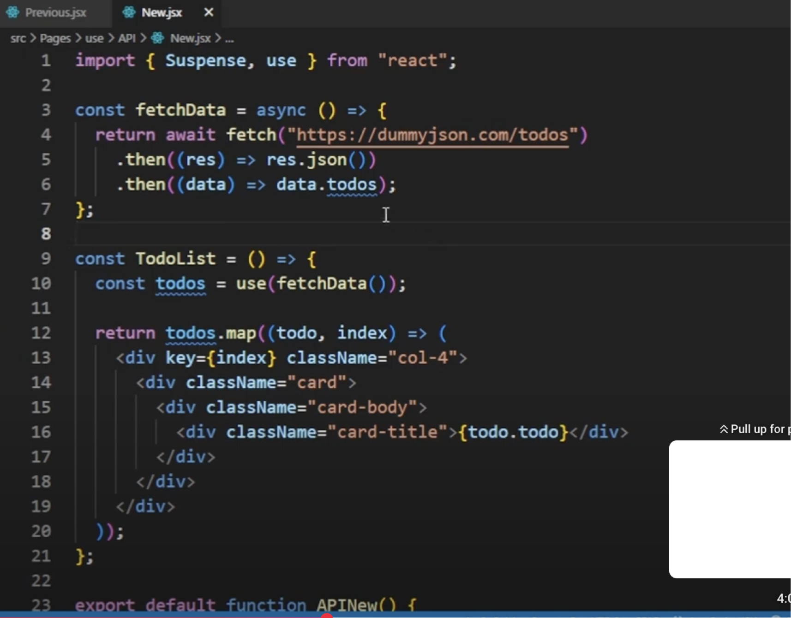

    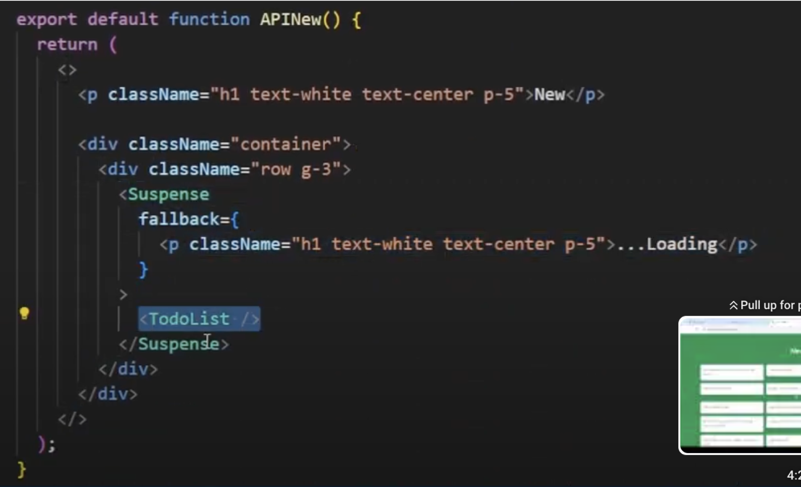

## Learn with Sumit

* [GitHub repo](https://github.com/learnwithsumit/react19)